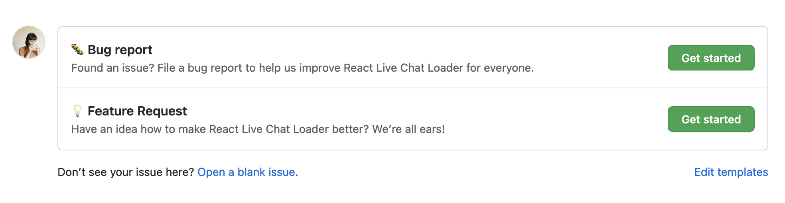

# Calibre’s templates and governance policies
This repository holds community health files and templates for Calibre’s open source and private repositories.

## ✅ What’s in this repository

### Code of Conduct
The `CODE_OF_CONDUCT` is a critical document outlining our standards and responsibilities in maintaining safe and inclusive spaces for everyone involved. We use [Contributor Covenant](https://github.com/EthicalSource/contributor_covenant) to communicate the community values and rules. **All of our open source repositories should have a Code of Conduct.**

### Contribution Guidelines
We use the `CONTRIBUTING` file to set expectations on how people should contribute to our open source projects. Following the contribution guidelines makes it easier for owners to review issues and pull requests. For contributors, following the guidelines helps avoid improperly created pull requests or issues, so they can get help or review faster. **All of our open source repositories should have a Contributing guide.**

🖇 [Learn more about `CONTRIBUTING`](https://docs.github.com/en/communities/setting-up-your-project-for-healthy-contributions/setting-guidelines-for-repository-contributors)

### Security Guidelines
The `SECURITY` file outlines our approach to handling security issues in any of our open source repositories. With a clear disclosure policy, we can triage and respond to vulnerability reports as quickly as possible. **Open source repositories should have Security guidelines (where relevant).**

🖇 [Learn more about `SECURITY`](https://docs.github.com/en/code-security/getting-started/adding-a-security-policy-to-your-repository)

### Pull Request Template

### Issue Templates
We use GitHub’s issue tracking in our open source projects. We’ve set up two templates in `ISSUE_TEMPLATE` folder to make creating issues (`--bug-report.md`) and feature requests (`--feature-request.md`) easier. When someone opens a new issue, they will be able to choose the option that feels right:

*An example of issue templates in action in our React Live Chat Loader repository ([see demo](https://github.com/calibreapp/react-live-chat-loader/issues/new/choose)).*

When working with issue templates, you might want to consider replacing instances of `your project` with the project name and add any relevant details that aren’t covered by the defaults. **All of our open source repositories should have issue templates.**

🖇 [Learn more about `ISSUE_TEMPLATES`](https://docs.github.com/en/communities/using-templates-to-encourage-useful-issues-and-pull-requests/about-issue-and-pull-request-templates#issue-templates)

### Code Owner Definitions
We use the `CODEOWNERS` file to define people (or teams) who are responsible for an entire repository (or a certain area). Thanks to `CODEOWNERS`, GitHub will automatically request reviews from relevant teammates as pull requests are created. **All of our repositories should have a Codeowners definition.**

🖇 [Learn more about `CODEOWNERS`](https://docs.github.com/en/repositories/managing-your-repositorys-settings-and-features/customizing-your-repository/about-code-owners)

### Organisation `README`
The profile `README` is displayed on [our GitHub organisation profile](https://github.com/calibreapp/). We use it to introduce ourselves and our projects to the community.

🖇 [Learn more about organisation profile `README`](https://docs.github.com/en/organizations/collaborating-with-groups-in-organizations/customizing-your-organizations-profile)

## ⛔️ What’s NOT in this repository

### Licensing
The license defines what others can and cannot do with open source code. Because the type of license will largely depend on the project, it’s been omitted here and should be added manually when you create one. **All of our public repositories should have a carefully chosen license file**.

🖇 [Learn more about `LICENSE`](https://docs.github.com/en/repositories/managing-your-repositorys-settings-and-features/customizing-your-repository/licensing-a-repository)